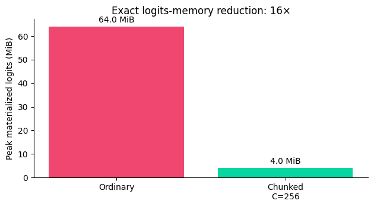
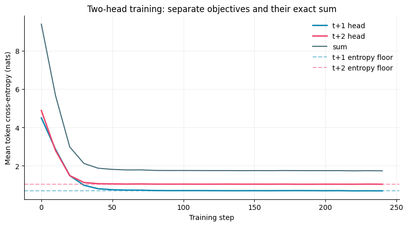

# ERA V5 — Session 9: Loss Functions & Output Heads

> An auditable, exact, and memory-aware language-model loss harness—from hidden states to next-token and multi-token supervision.

[](https://colab.research.google.com/github/JoeIndyGit/shiny-potato/blob/main/ERA_V5_Session_9_Loss_Functions_Output_Heads.ipynb)

**Primary submission:** [ERA_V5_Session_9_Loss_Functions_Output_Heads.ipynb](ERA_V5_Session_9_Loss_Functions_Output_Heads.ipynb)

**Evidence trail:** [executed notebook](ERA_V5_Session_9_Loss_Functions_Output_Heads.ipynb) · [execution log](EXECUTION_LOG.md) · [machine-readable results](session9_results.json) · [integrity validator](validate_submission.py)

The notebook is pre-executed, self-contained, and guarded by assertions. It requires no data download, API key, or hidden state. On CPU it runs in seconds; on a Colab GPU it additionally records incremental CUDA peak allocation above baseline for ordinary and chunked output-head cross-entropy.

Every numerical claim below is backed by an executed notebook output and mirrored in `session9_results.json`. `EXECUTION_LOG.md` provides the compact run transcript and SHA-256 artifact digests for independent review.

## Why this submission is different

A falling loss curve can hide a wrong shift, padding leakage, cross-document supervision, or a bidirectional attention bug. This project treats observability as part of correctness:

- decoded token strings prove every `x[t] → x[t+1]` and `x[t] → x[t+2]` alignment;
- a causality perturbation test proves future tokens cannot leak into earlier hidden states;
- padding and packed boundaries are validated by counts, gradients, and invariance tests;
- activation-checkpointed chunked cross-entropy is checked against ordinary CE at both the loss and gradient levels;
- `t+2` difficulty is demonstrated on held-out data with known theoretical entropy floors.

## Assignment coverage

| ID | Requirement | Implementation | Executed evidence |
|---|---|---|---|
| P1.1 | Print every tensor shape | Complete tensor contract from `[B,T]` tokens to scalar CE | `tokens=[24,10]`, `hidden=[24,10,32]`, `logits=[24,10,107]`, `loss_mask=[24,9]`, `per_token_loss=[24,9]`, `loss=[]`; all assertions pass |
| P1.2 | Verify the shift with strings | Decoded source/target audit | Human-readable `x[t] → x[t+1]` rows plus string-level assertions |
| P1.3 | Mask padding | Shifted-target mask and global valid-token denominator | `216` raw targets → `177` valid; ignored-position gradient is exactly zero |
| P1.4 | Pack two documents and mask boundary | Loss mask plus document-aware attention | Exactly one `<eos> → <bos>` transition removed; cross-document hidden-state delta `0` |
| P1.5 | Compute perplexity | Exact uniform anchor plus a genuinely random untrained head | Uniform PPL `106.999985`; random-head PPL `110.325386`, only `3.11%` from `V=107` |
| P1.6 | Tied vs untied parameters | True object/storage sharing and unique-parameter count | `6,848 → 3,424`; saves exactly `V×D = 3,424` parameters |
| P1.7 | Ordinary vs chunked CE | Activation-checkpointed token-chunked full-vocabulary CE | Loss delta `4.77e-07`; maximum gradient delta `1.49e-08` |
| P1.7 | Peak memory | Exact logits storage plus warmed Tesla T4 CUDA trials | Analytical: `64 MiB → 4 MiB` (`16×`); median forward+backward incremental peak above baseline: `192.000977 MiB → 16.001465 MiB` (`12.00×`) |
| P2 | Add a `t+2` head | Two independent bias-free heads; `L = Lₜ₊₁ + Lₜ₊₂` | Final `t+1=0.6984`, `t+2=1.0420`, exact sum `1.7404` |

## Required Part 1 evidence — seven results

This is the compact evidence summary requested in the brief. Every value is produced by an executed notebook cell rather than copied in by hand.

| # | Required result | Executed value | What it proves |
|---:|---|---:|---|
| 1 | Shape contract | `[24,10] → [24,10,32] → [24,10,107] → [24,9] → []` | Batch, sequence, hidden, vocabulary, shifted-token, and scalar dimensions agree. |
| 2 | Decoded shift | `<bos> → the`, `the → capital`, … | The target is the next **string**, not the current or previous token. |
| 3 | Padding contributors | `216 → 177` tokens; masked CE `4.869110` | Padding removes exactly `39` contributions; ignored logits have zero gradient. |
| 4 | Packed boundary | contributors `14 → 13`; CE `4.966307 → 5.011539` | The sole `<eos> → <bos>` label is removed. Its NLL (`4.378274`) was below the old mean, so the mean correctly rises. |
| 5 | Untrained perplexity | uniform `106.999985`; random `110.325386`; `V=107` | Both sit near vocabulary size; the exact uniform case also satisfies `CE=ln(V)`. |
| 6 | Head parameters | untied `6,848`; tied `3,424`; saved `3,424` (`50%`) | Tying removes exactly one `V×D` matrix and shares the same parameter object/storage. |
| 7 | Peak memory | analytical `64 → 4 MiB` (`16×`); Tesla T4 `192.000977 → 16.001465 MiB` (`12.00×`) | Five alternating-order trials after warm-up show that checkpointed token-chunking lowers synchronized forward+backward incremental peak allocation above baseline while preserving loss and gradients. |

## Key results

### 1. Correctness before optimization

The notebook refuses to treat a good-looking curve as proof. Its executable gates verify:

1. tensor contracts and decoded alignment;
2. strict causal attention;
3. padding exclusion and zero ignored gradients;
4. packed-document loss and attention isolation;
5. uniform-model loss/perplexity;
6. real weight identity under tying;
7. loss and gradient equivalence under chunking;
8. both `t+2` boundary crossings;
9. separate head losses and their exact unweighted sum.

### 2. Exact cross-entropy with lower peak memory

The ordinary path materializes logits for all `N` tokens:

\[
\text{peak logits elements}=N\times V.
\]

The custom chunked path slices hidden states **before** the output head, activation-checkpoints each chunk, computes token-loss sums, and divides once by the global valid-token count:

\[
\text{peak logits elements}=C\times V.
\]

It never averages per-chunk means and never changes the full-vocabulary objective. Checkpointing discards chunk logits in the forward pass and recomputes one chunk at a time during backward, so the same scalar-returning implementation is both mathematically verified and memory-profiled.



For the executed proxy (`N=4096`, `V=4096`, FP32, `C=256`), dominant logits storage falls from **64 MiB to 4 MiB**. After warming both paths, five alternating-order Tesla T4 trials measured the median synchronized forward-and-backward incremental peak allocation above baseline falling from **192.000977 MiB to 16.001465 MiB**, an empirical **12.00× reduction**.

At the V5 target scale:

- dense output head: `131,072 × 4,096 = 536,870,912` parameters;
- 256K-context bf16 logits: exactly **64 GiB**;
- 1,024-token bf16 chunk: exactly **256 MiB**;
- dominant-logits reduction: **256×**.

### 3. A controlled `t+2` experiment

The two-head experiment uses a fresh-batch, three-state Markov process. Each colour either stays or advances cyclically with probability `0.5`. This creates known conditional entropy floors:

\[
H(t+1)=\ln 2=0.6931,
\qquad
H(t+2)=1.5\ln 2=1.0397.
\]

That makes “`t+2` is harder” an evidence-based result for this experiment—not a universal claim or a hoped-for plot shape.



On held-out sequences after 240 steps:

| Objective | Initial CE | Final CE | Theoretical floor |
|---|---:|---:|---:|
| `t+1` | 4.4997 | **0.6984** | 0.6931 |
| `t+2` | 4.8818 | **1.0420** | 1.0397 |
| Exact sum | 9.3815 | **1.7404** | 1.7329 |

## Design decisions

- **Tiny causal Transformer:** real masked self-attention, small enough for fast CPU reproduction.
- **Offline word tokenizer:** decoded proofs without fragile external downloads.
- **Bias-free heads:** parameter accounting is exactly `V×D`.
- **Uniform-logit perplexity anchor:** exact `CE=ln(V)` and `PPL=V`; a generic random initialization is not falsely claimed to be exactly uniform.
- **Segment-aware packed attention:** document B cannot read document A.
- **FP32 equivalence tests:** tight and meaningful loss/gradient tolerances.
- **One checkpointed loss path:** the exact function tested for loss and gradient equivalence is also the function used in the CUDA memory experiment.
- **Fresh stochastic Part 2 batches:** prevents memorization below the known entropy floors.

## Reproduce

### Google Colab

1. Upload the notebook to GitHub or directly to Colab.
2. Optionally select **Runtime → Change runtime type → T4 GPU** to populate empirical CUDA memory fields.
3. Select **Runtime → Run all**. The final cell must print `ALL ASSIGNMENT GATES PASSED`.

### Local

```bash
python -m pip install -r requirements.txt
jupyter notebook ERA_V5_Session_9_Loss_Functions_Output_Heads.ipynb
```

The executed metrics are also captured in [session9_results.json](session9_results.json) to prevent README/notebook drift.

## Files

| File | Purpose |
|---|---|
| `ERA_V5_Session_9_Loss_Functions_Output_Heads.ipynb` | Complete, pre-executed assignment |
| `EXECUTION_LOG.md` | T4 run contract, training results, validation transcript, and artifact digests |
| `session9_results.json` | Machine-readable executed results |
| `memory_comparison.png` | Exact logits-memory comparison |
| `mtp_training_curves.png` | Held-out `t+1`, `t+2`, and summed losses |
| `requirements.txt` | Minimal local dependencies |
| `validate_submission.py` | Fast integrity and result-invariant checks |

## Limitations

- The controlled corpus isolates loss mechanics and horizon uncertainty; it does not measure downstream language quality.
- Tensor storage is reported analytically because Python heap profilers do not measure PyTorch allocator peaks correctly. The executed notebook additionally records synchronized incremental CUDA allocator peaks above baseline from five warmed, alternating-order Tesla T4 trials.
- The toy model can demonstrate tying because it has a `[V,D]` embedding table. V5's byte-codec input does not, so standard input/output weight tying is unavailable there.

## Final result

All seven Part 1 requirements and the complete Part 2 experiment are implemented, executed, summarized, and assertion-gated. The final notebook prints `ALL ASSIGNMENT GATES PASSED`.
